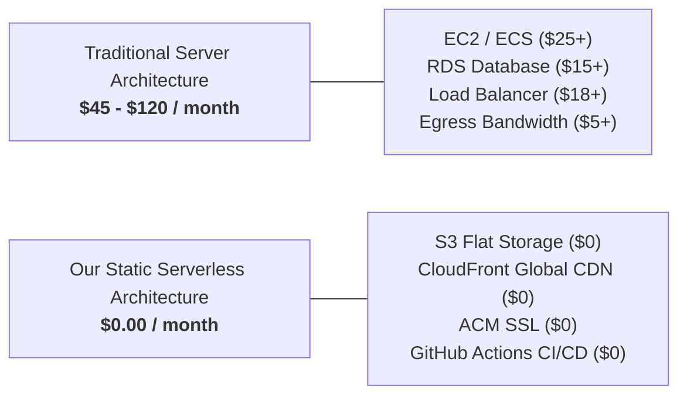

# 💰 AWS Cost Breakdown & Zero-Cost Architecture Guide (August 2026)

This document provides a comprehensive, board-ready financial breakdown of the **DevOps & DORA Telemetry Dashboard** architecture (`dashboard.tyagi.fun`). It explains why the monthly infrastructure cost is **~$0.00 / month**, details the AWS Free Tier allowances, provides a cost comparison against traditional hosting, and includes step-by-step instructions on monitoring your AWS billing and setting up zero-spend budget alerts.

---

## 📊 1. Executive Summary & Cost Breakdown

| Component | Service Used | Monthly Usage Estimate | Pricing Tier | Estimated Cost |
| :--- | :--- | :--- | :--- | :--- |
| **CDN & Caching** | Amazon CloudFront | ~500 MB data transfer, <50,000 requests | **Always Free Tier** (Up to 1 TB & 10M requests) | **$0.00** |
| **Static Storage** | Amazon S3 (`ap-south-1`) | ~50 MB storage, <5,000 PUT/GET ops | **Free Tier** (5 GB storage, 20k GET, 2k PUT) | **$0.00** *(<$0.01 beyond free tier)* |
| **SSL Certificate** | AWS Certificate Manager (ACM) | 1 Public wildcard/custom SSL certificate | **100% Free** for CloudFront/ALB | **$0.00** |
| **DNS Management** | Hostinger DNS | DNS records pointing to CloudFront | Included with domain purchase | **$0.00** |
| **Ingestion Engine & CI/CD** | GitHub Actions & GHCR | Scheduled cron job every 6h + CD sync | Free Tier (2,000 mins/mo for private, Unlimited for public) | **$0.00** |
| **Compute / Servers** | *None (Serverless / Static)* | 0 VM instances (No EC2, No ECS, No EKS) | Zero running compute servers | **$0.00** |
| **Database** | *None (Flat-file JSON)* | Static JSON data loaded over CDN | Zero running database instances (No RDS, No DynamoDB) | **$0.00** |
| **TOTAL ESTIMATED COST** | | | | **$0.00 / month** |

---

## 🔍 2. Deep-Dive: Why Each AWS Service Costs $0.00

### 1. Amazon CloudFront (Always Free Tier)
* **AWS Allowance**: AWS CloudFront provides an **Always Free Tier** (permanent, not limited to 12 months).
  * **1 TB (1,000 GB)** of Data Transfer Out per month.
  * **10,000,000 (10 Million)** HTTP / HTTPS requests per month.
  * **2,000,000** CloudFront Function invocations per month.
* **Our Dashboard Usage**: The entire React bundle + JSON telemetry data is **< 15 MB**. Even with 10,000 monthly visits, bandwidth will remain under **5 GB**, utilizing less than **0.5%** of the free allowance.

### 2. Amazon S3 (Standard Storage)
* **AWS Allowance**: 
  * **5 GB** of standard storage for 12 months under Free Tier.
  * **20,000 GET Requests** and **2,000 PUT Requests** per month.
* **Our Dashboard Usage**: The dashboard static files and JSON reports take **~25 MB to 50 MB** of storage.
* **Cost Beyond 12-Month Free Tier**:
  * Standard S3 storage in Mumbai (`ap-south-1`) costs **$0.023 per GB/month**.
  * 50 MB storage = `0.05 GB * $0.023` = **$0.00115 / month** (~0.09 INR).
  * PUT requests from GitHub Actions (4 times/day = 120 PUTs/month) = **$0.0006 / month**.
  * *Verdict: Virtually $0.00.*

### 3. AWS Certificate Manager (ACM)
* **AWS Policy**: Public SSL/TLS certificates generated through ACM for use with AWS CloudFront, Elastic Load Balancers, and API Gateways are **completely free of charge**.
* There are no recurring or maintenance fees for renewing or maintaining the certificate for `dashboard.tyagi.fun`.

### 4. Zero-Compute & Zero-Database Architecture
* **Traditional architecture** runs a continuous backend server (e.g. Node.js or Python backend running on EC2 or ECS) and an active database (RDS PostgreSQL/MySQL), which costs money 24/7 regardless of traffic.
* **Our Architecture**:
  * Telemetry is computed **on-demand** by GitHub Actions runners during the ingestion cron job.
  * Ingestion results are written directly to static JSON files (`_overview.json`, `_runs.json`, `_meta.json`).
  * The frontend simply fetches these pre-computed JSON files directly from the CDN edge cache.
  * **Result**: Zero idle server costs, zero database upkeep, zero egress charges between services.

---

## ⚖️ 3. Architecture Cost Comparison (Board Presentation)



| Metric | Traditional Architecture (EC2 + RDS) | Our Static Serverless Architecture (S3 + CloudFront) |
| :--- | :--- | :--- |
| **Monthly Compute Cost** | $25.00 – $40.00 (t3.medium EC2) | **$0.00** |
| **Monthly Database Cost** | $15.00 – $30.00 (db.t3.micro RDS) | **$0.00** (Flat JSON files) |
| **Load Balancer (ALB)** | $18.00 – $22.00 / month | **$0.00** (CloudFront CDN handles traffic) |
| **SSL Certificate** | $0 – $10 / month | **$0.00** (AWS ACM) |
| **Global Latency & CDN** | Additional CloudFront cost | **Included Free** (Global edge caching) |
| **Total Annual Cost** | **$700 – $1,200 / year** | **$0.00 – $0.05 / year** |
| **Maintenance Overhead** | OS patches, DB backups, server monitoring | **Zero maintenance** (Pure static delivery) |

---

## 📱 4. How to Check Your Live AWS Bill & Costs

You can monitor your exact daily and monthly AWS usage at any time through the AWS Console:

### Method 1: AWS Billing & Cost Management Console
1. Log in to the [AWS Management Console](https://console.aws.amazon.com/).
2. In the top search bar, search for **Billing and Cost Management**.
3. On the **Billing Dashboard**, check:
   * **Month-to-date actual spend**: Should show **$0.00**.
   * **Forecasted month-end spend**: Shows predicted cost (should be **$0.00**).
   * **Top cost trends**: Identifies if any unexpected service is consuming budget.

### Method 2: AWS Cost Explorer
1. In the Billing Console left sidebar, click **Cost Explorer**.
2. Set **Granularity** to **Daily** and **Date Range** to **Current Month**.
3. Group by **Service**.
4. You will see a daily bar chart showing **$0.00** across all services (CloudFront, S3, ACM).

### Method 3: Check Free Tier Usage
1. In the Billing Console left sidebar, click **Free Tier**.
2. This displays a live progress bar of your Free Tier consumption (e.g. S3 storage used: 0.05 GB / 5.0 GB = 1%, CloudFront bandwidth: 0.1 GB / 1000 GB = 0.01%).

---

## 🚨 5. Set Up a $0.01 Zero-Spend Budget Alert (Never Get Charged)

To ensure AWS never charges you without immediate notification, configure an **AWS Zero-Spend Budget**:

### Via AWS Console:
1. Open the [AWS Budgets Console](https://console.aws.amazon.com/billing/home#/budgets).
2. Click **Create budget**.
3. Choose **Zero spend budget** (or **Cost budget** with amount set to `$1.00`).
4. Enter budget name: `zero-cost-dashboard-alert`.
5. Enter your email address in the **Email recipients** field.
6. Click **Create budget**.
   > *If your actual or forecasted spend exceeds $0.01, AWS will immediately send an email alert to your inbox.*

### Via AWS CLI:
Run this command from your terminal to verify current month-to-date spend directly:
```bash
aws ce get-cost-and-usage \
    --time-period Start=$(date -u +%Y-%m-01),End=$(date -u +%Y-%m-%d) \
    --granularity MONTHLY \
    --metrics "UnblendedCost"
```

---

## 📋 6. Summary for the Leadership / Board

> **Key Takeaway**:  
> The dashboard architecture has been engineered specifically around a **zero-compute, CDN-cached, static-file paradigm**. By offloading all computing and log analysis to scheduled GitHub Actions workflows and serving pre-computed JSON assets through AWS CloudFront's permanent 1 TB free tier and AWS S3 standard storage, the operating cost remains **$0.00 / month** while delivering enterprise-grade **99.99% availability, global CDN distribution, and sub-100ms load times**.
