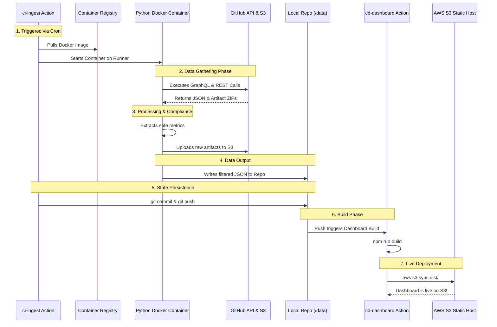

# Enterprise Dashboard Data Architecture

This document outlines the exact flow of how data is fetched from CI/CD providers, securely processed, and merged into our repository to power the React dashboard.

---

## 1. The Execution Strategy (Containerized Python)

Initially, we will focus on fetching data from **GitHub**. However, managing raw curl API calls and authentication tokens directly inside a YAML workflow is extremely difficult to maintain, especially when we eventually scale to GitLab and Jenkins.

Therefore, we will use a **Containerized Execution Strategy**:
1. **The Codebase**: We build a dedicated Python application containing all API logic (GraphQL/REST) and authentication handling.
2. **The Image**: This app is containerized into a Docker image and pushed to the GitHub Container Registry (GHCR).
3. **The Trigger**: The **ci-ingest.yml** GitHub Action triggers on a schedule. Its *only* job is to pull the Docker image and run it.
4. **The Execution**: The container runs on the client's runner, gathers data, and outputs structured JSON directly into **dashboard/public/data/github**.
5. **The Save**: The ci-ingest action takes those newly generated JSON files and commits them back to the main branch to persist the state.
6. **The Deployment**: After pushing to main, a separate **cd-dashboard.yml** action automatically triggers. The React frontend is rebuilt with the fresh JSON data and deployed live to **AWS S3 Static Hosting**, making the static dashboard feel entirely dynamic.

### Execution Flow Diagram


---

## 2. Compliance-First Approach (S3 Integration)

Storing raw security logs (like Gitleaks secrets or Trivy vulnerability details) in the public dashboard repository is a major compliance violation. 

To solve this, our container acts as a **Secure Filter**:
- It downloads the raw artifact from GitHub into memory.
- It extracts *only* safe, high-level metrics (e.g., "Total Critical Vulnerabilities: 5") to store in our JSON database.
- It zips the raw artifact file and pushes it directly to a secure **AWS S3 Bucket**.
- It writes the secure S3 download link into the JSON data, ensuring only authorized users can download the raw report.

If S3 is disabled in the configuration, the raw artifacts are discarded after metric extraction and the S3 download link field is set to null.

---

## 3. The Data Gathering Strategy

Because GitHub provides different APIs for different scales of data, our container uses a hybrid approach:

- **GraphQL (For the Bulky Data):** We fetch deeply nested, heavy data in a single API call. This includes the list of all repositories, open/closed PR and Issue counts, and top contributors.
- **REST API (For Granular Data):** GraphQL cannot fetch everything. We use standard REST API calls to pull specific granular data, such as runner cache sizes, specific workflow run durations, and raw text logs for failed jobs.
- **Artifact Processing:** Before uploading them to S3 (as per our compliance rule), we parse the artifacts locally to pull out the useful metrics for the dashboard.

---

## 4. The Rolling Window Strategy (State Management)

If the script attempted to download and parse artifacts for deep historical runs on every execution, it would take minutes to run and consume massive API rate limits. 

To ensure the script runs in seconds, we use a **Rolling Window**:
1. **Initial Sync (The History Stage)**: The user configures how much history they want to pull (e.g., HISTORY_DEPTH=10). The container fetches that exact number of past runs to build the historical baseline.
2. **Incremental Sync**: The next time the container runs, it only pulls the *latest* run(s) and appends them to the history.
3. **Trimming**: It maintains the user's configured depth. For example, if the user requested 10, the 11th oldest run will be automatically removed.
4. **Committing**: The GitHub Action commits this updated JSON back to the repository, permanently persisting the Rolling Window state for the next run.

---

## 5. Data Storage Architecture (Two-Level Structure)

We use an optimized **two-level file structure** instead of a hyper-modular per-run folder approach. All run data (jobs, errors, artifacts) is inlined into a single file per repo. This reduces frontend network requests by 10x while preserving complete data.

```text
dashboard/public/data/
├── _overview.json              <-- Org-level summary + DORA metrics
└── github/
    └── repos/
        └── {repo-name}/
            ├── _meta.json      <-- Repo insights (issues, PRs, contributors, cache)
            └── _runs.json      <-- Last N runs with jobs, errors, artifacts ALL inlined
```

| File | Purpose | Fetch Frequency |
| :--- | :--- | :--- |
| **_overview.json** | Landing page: DORA metrics, runner health, per-repo summary cards | Once on dashboard load |
| **_meta.json** | Deep repo insights: issues, PRs, cache, contributors, workflows | Once per repo drill-down |
| **_runs.json** | Rolling window of last N runs with full job details, error snippets, and artifact summaries inlined | Once per repo drill-down |

> For detailed JSON schemas and the artifact processing pipeline, see **data_structure_elaboration.md**.

---

## 6. Configuration Model

The ingestion engine is configured via a **config.yaml** file in the ingestion-engine directory. This allows users to customize the scope, depth, and behavior of the data collection without modifying code.

```yaml
github:
  org: "ot-central-team"
  repos: []                    # Empty = all repos in the org
  history_depth: 10            # Number of past runs to retain per repo
  workflows_filter: ["ci-*"]   # Only ingest runs from CI workflows

s3:
  enabled: false               # Toggle S3 uploads for raw artifacts
  bucket: "devops-raw-artifacts"
  region: "ap-south-1"
```

---

## 7. Error Handling and Retry Strategy

The Python ingestion script must handle failures gracefully without crashing the entire pipeline.

**API Failures (Rate Limits, Timeouts)**
- All GitHub API calls use **exponential backoff** with a maximum of 3 retries.
- If GitHub returns a 403 (rate limit exceeded), the script reads the **x-ratelimit-reset** header and waits until the reset window before retrying.
- If a specific repo fails after all retries, the script **logs the error and continues** to the next repo. It does not abort the entire run.

**Artifact Download Failures**
- If an artifact ZIP download fails or returns an invalid file, the script sets the artifact metrics to null and logs a warning. It does not block the remaining processing.

**S3 Upload Failures**
- If the S3 upload fails (network issue, credential expiry), the script sets **s3_raw_url** to null and logs the error. The safe metrics are still written to the JSON.

**Overall Failure Mode**: The script follows a **best-effort, skip-and-continue** strategy. A failure in one repo or one artifact does not cascade to the rest of the ingestion cycle.

---

## 8. Rate Limit Budget

GitHub's API has strict rate limits. The ingestion script is designed to stay well within these bounds on every execution cycle.

**GitHub REST API**: 5,000 requests/hour per PAT

| API Call | Count per Cycle | Notes |
| :--- | :--- | :--- |
| List workflow runs per repo | 1 per repo | Returns up to 100 runs per page |
| List jobs per run | 1 per new run | Only for newly fetched runs |
| Download job logs (failed only) | 1 per failed job | Only for jobs with conclusion = failure |
| List artifacts per run | 1 per new run | Only for newly fetched runs |
| Download artifact ZIP | 1 per artifact | Trivy, SonarQube, Gitleaks |
| Runner status | 1 per org | Single call for all runners |
| Cache usage | 1 per repo | Single call per repo |

**Estimated total for 5 repos, 1 new run each**: ~30 REST calls (well within the 5,000/hour limit).

**GitHub GraphQL API**: 5,000 points/hour per PAT

| Query | Points | Notes |
| :--- | :--- | :--- |
| Org overview (repos, issues, PRs, contributors) | ~10-20 points | Single query with nested fields |

**Estimated total per cycle**: ~20 GraphQL points. The script will never come close to the rate limit under normal operation.

---

## 9. Technology Stack Verdict: Python vs Go (Golang)

When deciding on the language for the data ingestion engine, we evaluated both Python and Go (Golang) based on performance, maintainability, and DevOps industry standards.

### Why Go (Golang)?
- **Maximum Performance**: Go compiles into a single, standalone static binary. No heavy runtime image needed — an **alpine** or **scratch** Docker image (around 5-15MB) is sufficient. The pipeline starts and finishes in seconds, saving runner minutes.
- **Strict Typing for APIs**: GitHub's GraphQL and REST APIs return massive, complex JSON payloads. Go's strict struct typing means if GitHub changes an API field, your code fails at compile time, not during a live pipeline run.
- **The Native Language of DevOps**: Kubernetes, Terraform, and Docker are all written in Go. It is the modern standard for cloud-native tooling.

### Why Python?
- **Universal DevOps Skill**: Almost every Platform, DevOps, or SRE engineer knows Python. If someone else inherits this repo in a year, they can instantly read and modify it. Go has a steeper learning curve.
- **JSON & Data Manipulation**: Parsing through deep JSON responses and SARIF files is generally quicker to write in Python (using simple dictionaries) compared to defining rigid structs in Go.
- **AWS Integration**: **boto3** is the gold standard for interacting with AWS S3, and it is straightforward to use.

### The Architectural Verdict
- Use **Go** for an enterprise-grade, lightning-fast compiled tool that uses almost zero CI/CD runner minutes.
- Use **Python** for a highly readable, easily maintainable script that any DevOps engineer on your team can tweak in 5 minutes.

Currently, we are proceeding with **Python** to prioritize ease of maintenance and scriptability by the wider DevOps team.

---

## 10. Related Documents

| Document | Description |
| :--- | :--- |
| **data_dictionary.md** | Every data point we collect, the exact API endpoint used, and the optimized two-level file structure with fetch count calculations |
| **data_structure_elaboration.md** | Full JSON schemas for _overview.json, _meta.json, and _runs.json, plus the artifact processing pipeline and rolling window mechanics |
| **why.md** | Business justification for building this dashboard instead of using GitHub's native UI, Backstage, or third-party SaaS tools |
