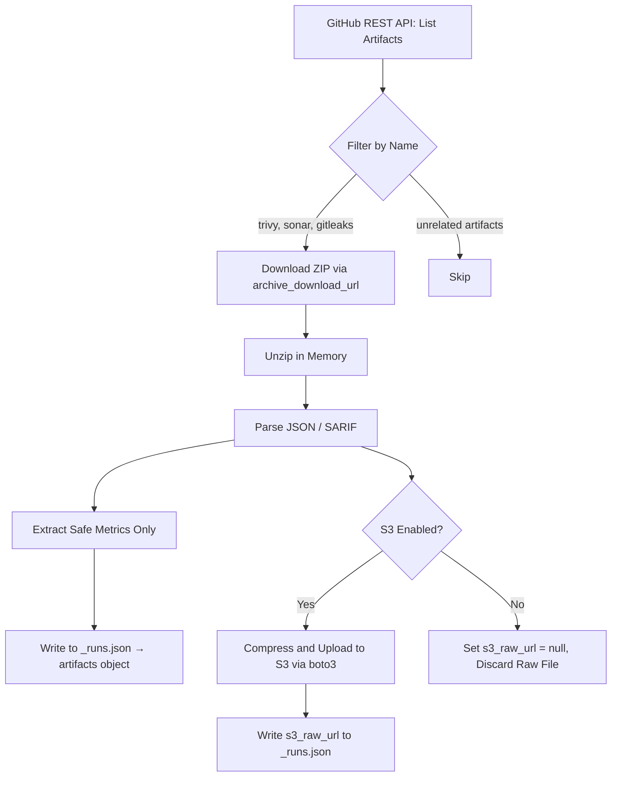

# Data Structure Elaboration

This document provides the exact JSON schemas for every file in our two-level storage structure, and explains how artifacts are processed, filtered, and pushed to S3.

---

## 1. Directory Structure

```text
dashboard/public/data/
├── _overview.json                    <-- 1 file: Org-level summary + DORA metrics
└── github/
    └── repos/
        ├── python-birla/
        │   ├── _meta.json            <-- Repo insights (issues, PRs, contributors, cache)
        │   └── _runs.json            <-- Last 10 runs with jobs, errors, artifacts ALL inlined
        ├── react-frontend/
        │   ├── _meta.json
        │   └── _runs.json
        └── java-backend/
            ├── _meta.json
            └── _runs.json
```

---

## 2. _overview.json — Org Landing Page

This is the first file the dashboard fetches. A single request gives the frontend everything it needs to render the landing page cards, DORA metrics, and runner health.

```json
{
  "org": "ot-central-team",
  "provider": "github",
  "last_synced": "2026-08-11T10:30:00Z",
  "sync_mode": "incremental",

  "summary": {
    "total_repos": 5,
    "total_runs_tracked": 42,
    "overall_success_rate": 78.5,
    "total_open_issues": 23,
    "total_open_prs": 7
  },

  "dora_metrics": {
    "deployment_frequency": {
      "value": 3.2,
      "unit": "deploys/week",
      "trend": "up"
    },
    "change_failure_rate": {
      "value": 18.5,
      "unit": "percent",
      "trend": "down"
    },
    "mttr": {
      "value": 42,
      "unit": "minutes",
      "trend": "stable"
    },
    "pr_cycle_time": {
      "value": 6.3,
      "unit": "hours",
      "trend": "down"
    }
  },

  "runners": [
    {
      "name": "self-hosted-linux-1",
      "status": "online",
      "os": "Linux",
      "busy": false
    },
    {
      "name": "self-hosted-linux-2",
      "status": "offline",
      "os": "Linux",
      "busy": false
    }
  ],

  "repos": [
    {
      "name": "python-birla",
      "language": "Python",
      "last_run_status": "failure",
      "last_run_at": "2026-08-04T16:34:15Z",
      "success_rate": 66.7,
      "open_issues": 5,
      "open_prs": 2
    },
    {
      "name": "react-frontend",
      "language": "JavaScript",
      "last_run_status": "success",
      "last_run_at": "2026-08-10T09:12:00Z",
      "success_rate": 90.0,
      "open_issues": 3,
      "open_prs": 1
    }
  ]
}
```

---

## 3. _meta.json — Per-Repo Deep Insights

This file contains repo-level metadata that does not change per pipeline run. It is fetched when a user clicks into a specific repository on the dashboard.

```json
{
  "name": "python-birla",
  "full_name": "vishuops0210/python-birla",
  "language": "Python",
  "default_branch": "main",
  "last_synced": "2026-08-11T10:30:00Z",

  "insights": {
    "open_issues": 5,
    "closed_issues": 42,
    "open_prs": 2,
    "merged_prs_last_7d": 8
  },

  "cache_usage": {
    "total_size_mb": 156.3,
    "total_count": 12
  },

  "top_contributors": [
    { "login": "vishuops0210", "commits_last_30d": 47 },
    { "login": "dev-ravi", "commits_last_30d": 23 },
    { "login": "qa-nisha", "commits_last_30d": 11 }
  ],

  "workflows": [
    { "name": "Python CI/CD Pipeline", "file": "ci-python.yml" },
    { "name": "Custom Deployment Pipeline", "file": "deploy.yml" }
  ]
}
```

---

## 4. _runs.json — The Rolling Window

This is the core data file. It contains the last N runs (default 10), with every job, every error, and every artifact summary **inlined** into each run entry. No separate files needed.

```json
{
  "repo": "python-birla",
  "history_depth": 10,
  "total_runs": 3,
  "runs": [
    {
      "run_id": "30929505352",
      "workflow": "Python CI/CD Pipeline",
      "branch": "main",
      "sha": "6ce0fab",
      "trigger": "push",
      "status": "failure",
      "conclusion": "failure",
      "created_at": "2026-08-04T16:31:00Z",
      "completed_at": "2026-08-04T16:34:15Z",
      "duration_seconds": 195,

      "jobs": [
        {
          "name": "Secret Scanning (Gitleaks)",
          "status": "success",
          "duration_seconds": 10,
          "error_snippet": null
        },
        {
          "name": "Unit Tests & Coverage",
          "status": "success",
          "duration_seconds": 33,
          "error_snippet": null
        },
        {
          "name": "SCA (Trivy FS)",
          "status": "success",
          "duration_seconds": 10,
          "error_snippet": null
        },
        {
          "name": "SAST (SonarQube)",
          "status": "failure",
          "duration_seconds": 22,
          "error_snippet": "SonarQube scanner failed: Could not connect to host sonar.example.com on port 9000"
        },
        {
          "name": "Build Docker Image",
          "status": "success",
          "duration_seconds": 40,
          "error_snippet": null
        },
        {
          "name": "Push to Docker Hub",
          "status": "failure",
          "duration_seconds": 18,
          "error_snippet": "Error response from daemon: unauthorized: incorrect username or password"
        },
        {
          "name": "Push to Amazon ECR",
          "status": "skipped",
          "duration_seconds": 0,
          "error_snippet": null
        }
      ],

      "artifacts": {
        "trivy": {
          "critical": 2,
          "high": 5,
          "medium": 12,
          "low": 34,
          "s3_raw_url": "https://s3.ap-south-1.amazonaws.com/devops-artifacts/python-birla/30929505352/trivy-results.zip"
        },
        "sonarqube": {
          "quality_gate": "FAILED",
          "coverage_percent": 72.4,
          "bugs": 3,
          "vulnerabilities": 1,
          "code_smells": 28,
          "s3_raw_url": "https://s3.ap-south-1.amazonaws.com/devops-artifacts/python-birla/30929505352/sonar-report.zip"
        },
        "gitleaks": {
          "secrets_found": 0,
          "s3_raw_url": null
        }
      }
    },

    {
      "run_id": "30899815645",
      "workflow": "Python CI/CD Pipeline",
      "branch": "main",
      "sha": "efc2669",
      "trigger": "push",
      "status": "success",
      "conclusion": "success",
      "created_at": "2026-08-04T10:12:00Z",
      "completed_at": "2026-08-04T10:16:33Z",
      "duration_seconds": 273,

      "jobs": [
        {
          "name": "Secret Scanning (Gitleaks)",
          "status": "success",
          "duration_seconds": 9,
          "error_snippet": null
        },
        {
          "name": "SAST (SonarQube)",
          "status": "success",
          "duration_seconds": 14,
          "error_snippet": null
        },
        {
          "name": "Build Docker Image",
          "status": "success",
          "duration_seconds": 41,
          "error_snippet": null
        }
      ],

      "artifacts": {
        "trivy": {
          "critical": 0,
          "high": 3,
          "medium": 10,
          "low": 30,
          "s3_raw_url": "https://s3.ap-south-1.amazonaws.com/devops-artifacts/python-birla/30899815645/trivy-results.zip"
        },
        "sonarqube": {
          "quality_gate": "PASSED",
          "coverage_percent": 82.1,
          "bugs": 1,
          "vulnerabilities": 0,
          "code_smells": 15,
          "s3_raw_url": null
        },
        "gitleaks": {
          "secrets_found": 0,
          "s3_raw_url": null
        }
      }
    }
  ]
}
```

---

## 5. Artifact Processing Pipeline

When the Python ingestion script encounters a workflow run that produced artifacts (Trivy, SonarQube, Gitleaks), it follows this exact pipeline:

### Step-by-Step Flow

**Step 1 — Discover Artifacts**
The script calls the GitHub REST API to list all artifacts attached to a workflow run:

    GET /repos/{owner}/{repo}/actions/runs/{run_id}/artifacts

This returns an array of artifact objects. The script filters for names matching **trivy**, **sonar**, **gitleaks**, **coverage**, or **report**.

**Step 2 — Download the Artifact ZIP**
Each artifact is downloaded as a ZIP file via the archive_download_url. GitHub requires the PAT for authentication. The script downloads into memory (not to disk) to avoid leaving sensitive data on the runner filesystem.

**Step 3 — Extract and Parse**
The script unzips the artifact in memory and reads the contents based on the artifact type:

| Artifact Type | File Inside ZIP | What We Extract |
| :--- | :--- | :--- |
| **Trivy FS Scan** | trivy-results.json | Count of vulnerabilities grouped by severity (Critical, High, Medium, Low) |
| **SonarQube Report** | sonar-quality-gate.json | Quality gate status (PASSED/FAILED), coverage percentage, bug count, vulnerability count, code smell count |
| **Gitleaks SARIF** | gitleaks-results.sarif | Length of the results array = number of secrets found |

**Step 4 — Write Safe Metrics to JSON**
The extracted counts and statuses are written into the **artifacts** object inside the corresponding run entry in **_runs.json**. Only safe, high-level numbers are stored — never the raw vulnerability descriptions, secret values, or detailed code paths.

**Step 5 — Upload Raw Artifact to S3 (Compliance)**
If S3 is enabled in the configuration, the script:
1. Compresses the raw artifact file into a ZIP
2. Uploads it to the configured S3 bucket using **boto3** under the path: **{repo_name}/{run_id}/{artifact_type}.zip**
3. Generates a pre-signed download URL (valid for 7 days) or a permanent S3 object URL depending on the bucket's access policy
4. Writes this URL into the **s3_raw_url** field in the JSON

If S3 is disabled, the **s3_raw_url** field is set to null and the raw artifact is discarded after metric extraction.

### Artifact Processing Flow Diagram



---

## 6. Rolling Window Mechanics

The rolling window ensures the script runs in seconds instead of minutes on every execution.

### First Run (Initial Sync)

On the very first execution, the script has no existing **_runs.json** to read. It performs a full historical fetch:

1. Calls GET /repos/{owner}/{repo}/actions/runs with per_page set to the configured HISTORY_DEPTH (e.g., 10)
2. For each of those 10 runs, fetches jobs and downloads/processes artifacts
3. Writes the complete **_runs.json** with all 10 entries

### Subsequent Runs (Incremental Sync)

On every following execution:

1. Reads the existing **_runs.json** from the repo
2. Checks the run_id of the most recent entry
3. Calls the GitHub API and only fetches runs **newer** than that run_id
4. Appends the new run(s) to the top of the array
5. If the array exceeds HISTORY_DEPTH, trims the oldest entries from the bottom
6. Overwrites **_runs.json** with the updated array

| Sync Cycle | Action | Array State |
| :--- | :--- | :--- |
| 1st (Initial) | Fetch last 10 runs | run_10, run_9, ... run_1 |
| 2nd | Fetch run_11, trim run_1 | run_11, run_10, ... run_2 |
| 3rd | Fetch run_12, trim run_2 | run_12, run_11, ... run_3 |
| No new runs | No API calls needed, skip | No change |
